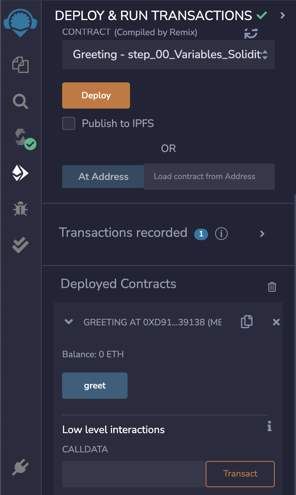

# Solidity
Solidity is hight level, statically types programming language.

## pragma
Pragma is generally the first line of code within any Solidity file. it's used to define compiler version. 

`pragma solidity ^0.8.9;`

`^` symbol is called caret. it's used to define minimum limit. The above pragma script is showing that the minimum compiler version should me 0.8.9 and any version above the version mentioned but less than the next major version.

## Variables in Solidity

Variables are used to store data that can be manipulated and used in smart contract functions. Solidity supports several data types.


## Data Types

- **Boolean:** bool type for storing true or false values.
- **Integer:** uint and int types for storing positive and negative whole numbers, respectively. They can have a specified number of bits (e.g., uint8 for an 8-bit unsigned integer).
- **Address:** address type for storing Ethereum addresses.
- **String:** string type for storing variable-length text data.
- **Bytes:** bytes and byte types for storing byte arrays and single bytes, respectively.
- **Array:** array type for storing ordered lists of variables. They can be either fixed-size (uint[3]) or dynamic (uint[]).
- **Mapping:** mapping type for storing key-value pairs. They are similar to hash tables or dictionaries in other programming languages.


## Deployment

To deploy this project locally on VS Code run

```bash
  npm i @remix-project/remixd
  remixd
```
Here is a [link](https://www.npmjs.com/package/@remix-project/remixd) of remixd package.

And then connect this to your remote [Remix](https://remix.ethereum.org/)


## Connectivity Steps:
<br>


<br>

## Compile &  Deploy Contract (Remix):

<br>
Compile & deploy:


Press greet to get the greeting:


